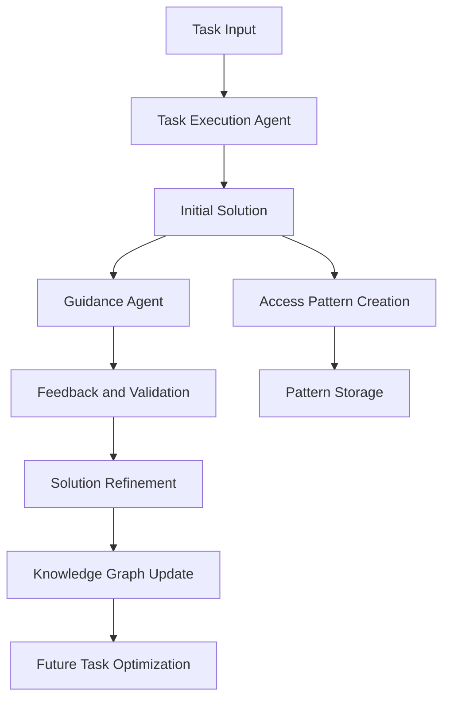

# Nexus Framework Documentation

Welcome to the Nexus Framework documentation. This guide will help you understand and implement Nexus in your projects.

## Quick Navigation

- [Getting Started](/docs/getting-started)
- [Core Concepts](/docs/concepts)
- [Components](/docs/components)
- [API Reference](/docs/api)
- [Contributing](/docs/contributing)
- [Security](/docs/security)

## Overview

Nexus is built on a unique dual-LLM architecture that combines the power of two AI models in a mentor-mentee relationship. This approach ensures:

- Higher quality solutions through continuous validation
- Efficient knowledge sharing and pattern recognition
- Robust error detection and correction
- Continuous learning and improvement

## Architecture



## Core Features

### 1. Dual-Agent System
The heart of Nexus is its dual-agent architecture:
- **Task Execution Agent (Mentee)**: Implements solutions
- **Guidance Agent (Mentor)**: Validates and guides

### 2. Knowledge Graph
Stores and manages:
- Access patterns
- Solution flows
- Domain knowledge
- Usage statistics

### 3. Web Intelligence
Advanced capabilities for:
- Content extraction
- Pattern recognition
- Semantic analysis

## Installation

```bash
# Using Go
go get github.com/gavinvolpe/nexus

# Using Docker
docker pull gavinvolpe/nexus
```

## Quick Start

```go
package main

import (
    "github.com/gavinvolpe/nexus"
)

func main() {
    // Initialize Nexus
    nx := nexus.New(nexus.DefaultConfig())

    // Create agents
    mentor := nx.NewMentorAgent()
    mentee := nx.NewMenteeAgent()

    // Start collaboration
    solution := mentee.ProposeSolution(task)
    feedback := mentor.ReviewSolution(solution)
}
```

## Next Steps

1. Read the [Getting Started](/docs/getting-started) guide
2. Explore [Core Concepts](/docs/concepts)
3. Join our [Community](/community)
4. Contribute to [Development](/docs/contributing)
