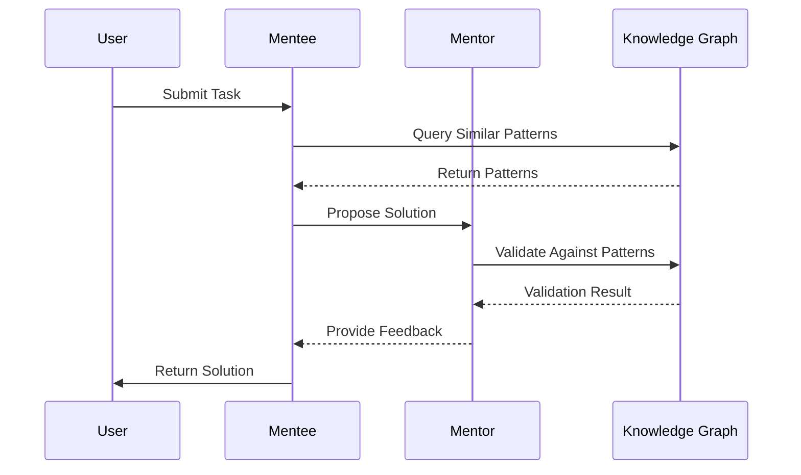

# Components

The Nexus Framework is built on a modular architecture with several key components working together to provide a robust AI collaboration system.

## Core Components

### 1. Dual-Agent System

#### Task Execution Agent (Mentee)
```go
type MenteeAgent interface {
    // Core capabilities
    ProposeSolution(ctx context.Context, task Task) (Solution, error)
    ImplementCode(ctx context.Context, design Design) (Code, error)
    ExplainReasoning(ctx context.Context, decision Decision) (Explanation, error)
    ApplyFeedback(ctx context.Context, feedback Feedback) (Improvement, error)
}
```

#### Guidance Agent (Mentor)
```go
type MentorAgent interface {
    // Core capabilities
    ReviewSolution(ctx context.Context, solution Solution) (Review, error)
    ProvideContext(ctx context.Context, query Query) (Context, error)
    SearchKnowledge(ctx context.Context, topic Topic) ([]Pattern, error)
    ValidateImplementation(ctx context.Context, code Code) (ValidationResult, error)
}
```

### 2. Knowledge Graph

```go
type KnowledgeGraph interface {
    // Graph operations
    StorePattern(pattern Pattern) PatternID
    QueryPatterns(criteria Criteria) []Pattern
    UpdatePattern(id PatternID, update Update) bool
    FindSimilar(pattern Pattern) []Pattern
    
    // Analytics
    TrackUsage(pattern Pattern)
    CalculateEffectiveness(pattern Pattern) Metrics
    SuggestImprovements(pattern Pattern) []Suggestion
}
```

### 3. Web Intelligence

```go
type WebIntelligence interface {
    // Content extraction
    ExtractContent(url string) (Content, error)
    ParseStructure(content Content) (Structure, error)
    
    // Pattern analysis
    IdentifyPatterns(content Content) ([]Pattern, error)
    ValidateContent(content Content) (ValidationResult, error)
}
```

## Component Interactions

### Task Execution Flow



### Knowledge Acquisition

1. **Pattern Recognition**
   ```go
   // Example pattern recognition
   pattern := kg.IdentifyPattern(solution)
   effectiveness := kg.CalculateEffectiveness(pattern)
   if effectiveness.Score > threshold {
       kg.StorePattern(pattern)
   }
   ```

2. **Learning Loop**
   ```go
   // Continuous learning process
   for solution := range solutions {
       feedback := mentor.ReviewSolution(solution)
       patterns := kg.ExtractPatterns(solution, feedback)
       kg.UpdatePatterns(patterns)
   }
   ```

## Configuration

### Agent Configuration
```yaml
mentor:
  model: gpt-4
  temperature: 0.7
  context_window: 8000

mentee:
  model: gpt-3.5-turbo
  temperature: 0.5
  context_window: 4000
```

### Knowledge Graph Configuration
```yaml
knowledge_graph:
  storage: postgresql
  index_type: vector
  cache_size: 1000
  ttl: 24h
```

## Best Practices

1. **Agent Communication**
   - Use structured messages
   - Include context in requests
   - Handle timeouts gracefully

2. **Pattern Management**
   - Regularly validate patterns
   - Remove outdated patterns
   - Track pattern usage

3. **Error Handling**
   - Implement retry logic
   - Log all interactions
   - Monitor performance

## Performance Considerations

### Optimization Techniques

1. **Caching**
   ```go
   cache := nexus.NewCache(nexus.CacheConfig{
       Size: 1000,
       TTL: time.Hour,
   })
   ```

2. **Batch Processing**
   ```go
   batch := nexus.NewBatch(nexus.BatchConfig{
       Size: 100,
       Timeout: time.Second * 30,
   })
   ```

3. **Rate Limiting**
   ```go
   limiter := nexus.NewRateLimiter(nexus.RateConfig{
       RequestsPerSecond: 10,
       BurstSize: 20,
   })
   ```

## Monitoring

### Key Metrics

1. **Agent Performance**
   - Response time
   - Success rate
   - Error frequency

2. **Knowledge Graph**
   - Pattern usage
   - Query performance
   - Storage utilization

3. **System Health**
   - Memory usage
   - CPU utilization
   - Network latency

## Next Steps

- Explore the [API Reference](/docs/api)
- Learn about [Security](/docs/security)
- Read our [Contributing Guide](/docs/contributing)
